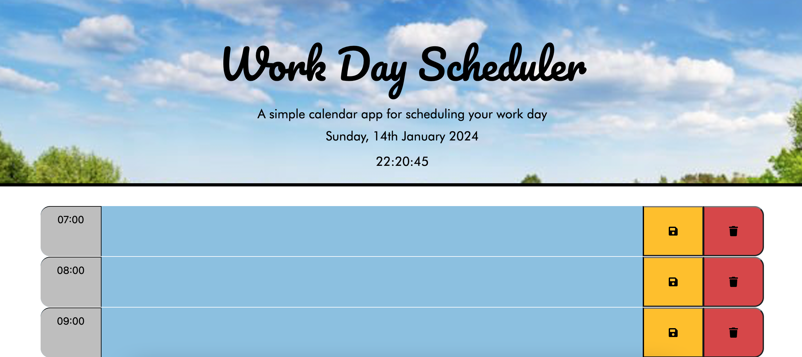

# Lianna-Calendar-App: Work Day Scheduler

## Description

The task was to create a simple calendar application that allows a user to save events for each hour of the day. The app uses the Moments.js library instead of Day.js to work with time and date, as it was more convenient when displaying ordinal numbers for the date display.

### Tasks Completed

* Current day and time displayed at the top of the calender when planner opened.
 
* Time blocks for standard business hours created.
 
* Each time block colour-coded based on past, present, and future when viewed.

* User is able to enter event when time block is clicked.
 
* User events saved in local storage when save button is clicked.

* User events removed from local storage when delete button is clicked.

* Saved events persist between page refreshes.

### Links

Deployed website: (https://lianna87.github.io/Lianna-Calendar-App/)

Code repository: (https://github.com/Lianna87/Lianna-Calendar-App)

#### Usage

The webpage can be viewed in a traditional desktop web browser, table or phone once deployed. 

#### Screenshots

